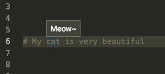

# Custom Code Decorator for VSCode

Create your own, customized, per-project code decorators, simpy putting a `.vslinter.js` file in your project!

Sometimes certain projects may need custom code analysis that could not be mapped in a generic way.

No worries, now create your own!

Here's an example `.vslinter.js` file that colors the word "cat" in your code and writes "Meow~" as a description:

```javascript
module.exports = {
	// Defining style
  style(vscode) {
    return {
      borderWidth: '1px',
      borderStyle: 'dotted',
      overviewRulerColor: 'red',
      overviewRulerLane: vscode.OverviewRulerLane.Right,
      light: { borderColor: 'lightred' },
      dark: { borderColor: 'darkred' },
    };
  },
	// Matching the word "cat" and colorize it, adding a hoverMessage "Meow~"
  lint(document, rangesToDecorate) {
    const regex = /\scat\s/g
    const text = document.getText();
    let match = regex.exec(text);

    while (match) {
      const decoration = {
        'range': [match.index + 1, match.index + match[0].length - 1],
        'hoverMessage': 'Meow~'
      };
      rangesToDecorate.push(decoration);
      match = regex.exec(text);
    }
  }
}
```

Here's the result:



### Some use cases:
* Defining custom linters for the current project
* Validating JSON files using custom JSON schemas
* Custom security requirements for a project
* Resolving names and suggesting similar elements

Install it on VS Code: https://marketplace.visualstudio.com/items?itemName=monade.vscode-custom-code-decorator

## Future work / Suggestions:

https://github.com/monade/vscode-custom-code-decorator/issues

## If you want to experiment with the source code:

- (do the usual steps to download from GitHub and navigate to folder)
- `npm install` (just once inside the folder)
- `npm run watch` (every time you want to test it)
- open folder in VS Code and hit F5 or go to Debug and click on the green triangle play button

The key file to edit is `extension.ts` (in the `src` folder).

# Special Thanks

The initial idea and part of the code comes from this plugin:
https://github.com/hchiam/custom-vscode-linter
